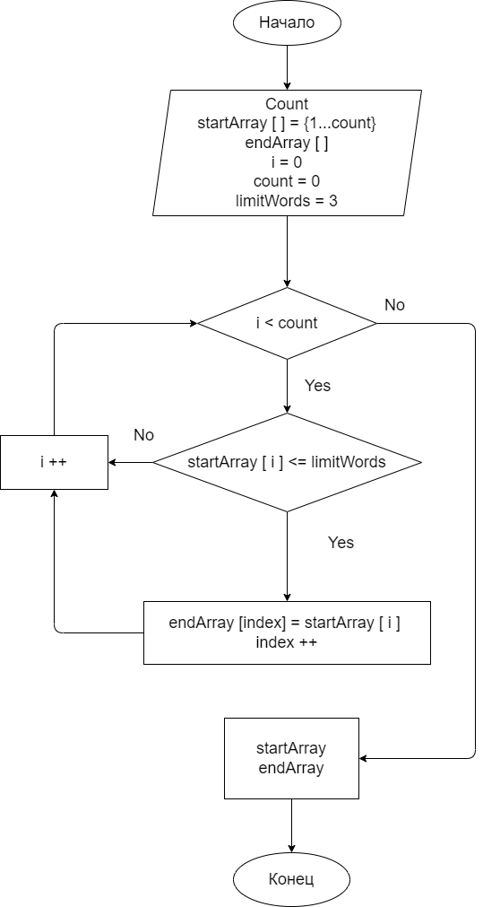

## Итоговая проверочная работа.
___

**Поставленная задача:**
___

Написать программу, которая из имеющегося массива строк формирует массив из строк, длина которых меньше либо равна 3 символа. Первоначальный массив можно ввести с клавиатуры, либо задать на старте выполнения алгоритма. При решении не рекомендуется пользоваться коллекциями, лучше обойтись исключительно массивами.

**Алгоритм действий:**
___

1. Перебрать значение исходного массива
1. Проверить каждое значение из массива на уловие: *длина строки должна быть меньше либо равна 3 символам*
1. Если строка удовлетворяет условию, переносим значение в созданный массив
1. Повторяем, указанный выше, второй и третий пункт до тех пор, пока не дойдем до конца массива
1. Выводим заполненный массив в виде результата

**Блок схема**

 | [Код](Program.cs)